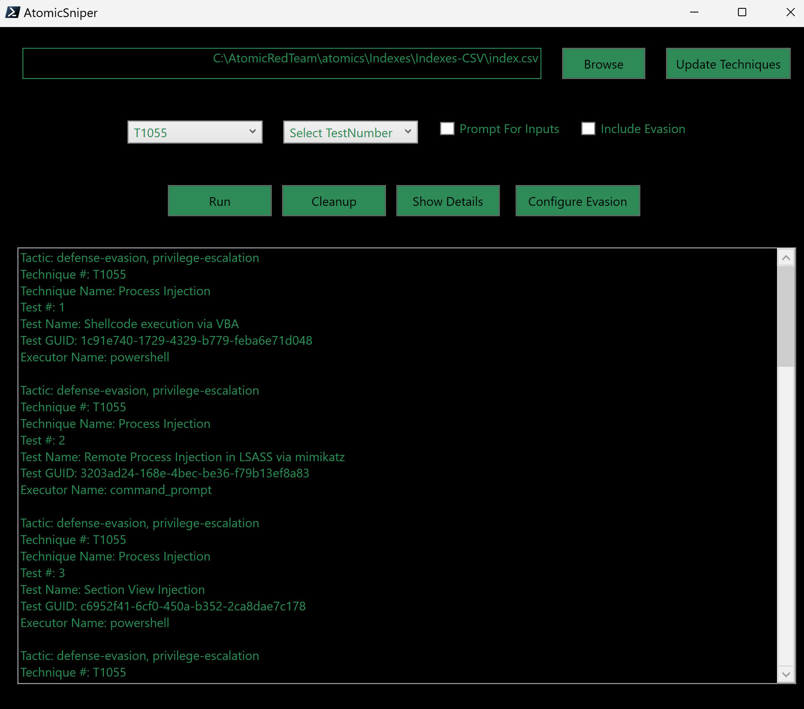
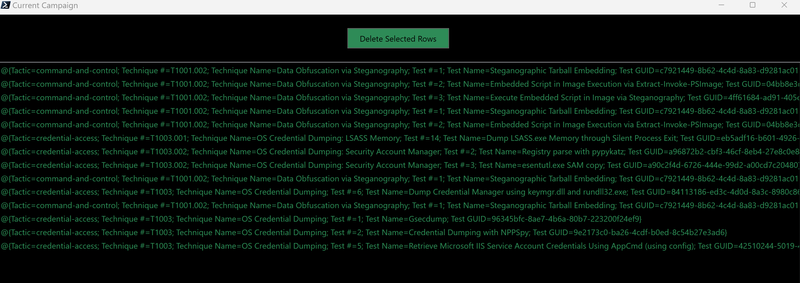

# AtomicFootball

This project provides a set of PowerShell scripts for executing Atomic Red Team tests, managing exclusions in various security products, and handling setup and dependencies for smooth execution.

## Overview

The project includes the following components:

1. **Setup Script `AtomicSetup.ps1`:** Ensures the necessary tools and scripts are downloaded and set up.
2. **Atomic Base Script `AtomicBase.ps1`:** A GUI-based script that acts as the main interface to launch all other scripts.
3. **Precision Execution Script `AtomicSniper.ps1`:** A GUI-based script for executing AtomicRedTeam tests, managing ProcMon, and logging results.
4. **Campaign Runner Script `AtomicCampaignRunner.ps1`:** A GUI-based script for running multiple Atomic Red Team tests in sequence with extensive logging and state persistence.
5. **Campaign Builder Script `AtomicCampaignBuilder.ps1`:** A GUI-based script for selecting and building a custom list of Atomic Red Team tests to run in a campaign.
6. **Campaign Viewer GUI:** A new feature within the `AtomicCampaignBuilder.ps1` script that allows users to view and manage the current campaign CSV, including the ability to delete selected rows.

## Prerequisites

- PowerShell 5 or later
- Internet connection to download necessary tools and scripts
- Administrative privileges to run certain commands

## Setup Instructions


### Launching the Form
1. Save the script file to your local machine with a `.ps1` extension, e.g., `AtomicSetup.ps1`.
2. Open PowerShell with administrative privileges.
3. Change directory to the location of the saved script.
4. Execute the script.

### Using the Form

#### Setup AtomicFootball Directory
1. **Setup AtomicFootball**
    - This will build the AtomicFootball directory from the repository.
    - You can specify the directory location in the text box. The default location is `C:\`.
    - Click the **Setup AtomicFootball** button to download and extract the AtomicFootball repository into the specified directory.
    - The Exclusion Helper script will run automatically to provide insights into where you will need to add exclusions for the atomics. I recommend creating the directory you intend to exclude in your AV and adding the exclusion before installing the atomics.

#### Install Invoke-AtomicRedTeam Framework
1. **Configure Atomic Red Team Installation Options and Arguments**
    - This section allows you to install the Invoke-AtomicRedTeam framework with various optional arguments.
    - **Include Atomics**: Includes the Atomics folder containing test definitions. Necessary for running tests.
    - **Force Install**: Forces the installation even if the module is already installed. Use this to update or reinstall.
    - **No Payloads**: Installs the atomics directory with only the test definition YAML files and no payloads.
    - **Install Path**: Specify the installation path for Invoke-AtomicRedTeam. Default is `C:\AtomicRedTeam`.
    - **Repo Owner**: Specifies the GitHub repository owner. Default is `redcanaryco`.
    - **Branch**: Specifies the branch to use from the repository. Default is `master`.

2. **Install Atomic Red Team**
    - Click the **Install Atomic Red Team** button to install the Invoke-AtomicRedTeam framework with the specified options.

3. **Install Powershell Modules**
    - Installs the required PowerShell modules (`invoke-atomicredteam` and `powershell-yaml`) from the PowerShell Gallery.
    - Click the **Install Powershell Modules** button to install the modules.

#### Setup Procmon
1. **Setup Procmon**
    - This will configure Procmon (Process Monitor) and direct the output to the AtomicFootball directory.
    - Click the **Setup Procmon** button to download and extract Process Monitor, which is launched to ensure you have accepted the EULA before attempting your first test. You should exit Procmon before proceeding.

#### Reference
- **Invoke-AtomicRedTeam Wiki**
    - Click the hyperlink to open the Invoke-AtomicRedTeam Wiki in your default web browser for more information and detailed documentation.

## Example Usage
1. Launch the form by running `.\AtomicSetup.ps1` as an administrator.
2. Specify the desired directory for AtomicFootball or use the default.
3. Click **Setup AtomicFootball** to download and set up the directory.
4. Adjust any options for the Invoke-AtomicRedTeam installation.
5. Click **Install Powershell Modules** to install the required PowerShell modules.
6. Click **Install Atomic Red Team** to install the framework.
7. Click **Setup Procmon** to configure Process Monitor.

## Support
For support and further information, refer to the [Invoke-AtomicRedTeam Wiki](https://github.com/redcanaryco/invoke-atomicredteam/wiki/).

## AtomicFootball Usage

### Running the Atomic Base Script

After the setup script has been run, use the `AtomicBase.ps1` script to launch the main interface for accessing all other scripts. This script provides a unified GUI for managing and running the various components of the project.

To run the Atomic Base script:

```powershell
.\AtomicBase.ps1
```


### Running the Execution Script

This script provides a GUI for executing AtomicRedTeam tests and managing ProcMon and logs.

To run the execution script:

```powershell
.\AtomicSniper.ps1
```


Snipe like a pro: load your atomic campaign csv in place of the full index to retest a curated list from your campaign.

### Configuring Evasion Techniques

The `Configure Evasion` button in the `AtomicSniper.ps1` script opens a new popup window that allows users to select and configure evasion techniques to run before the main test. This popup includes:

- **Filters:** ComboBoxes for filtering techniques by Tactic and Technique, and a TextBox for keyword filtering.
- **Technique List:** Displays the list of techniques based on the selected filters, each with a checkbox for selection.
- **Save Evasion Techniques Button:** Saves the selected techniques to a new evasion CSV, overwriting any existing file.
- **Update Evasion Techniques Button:** Updates the existing evasion CSV with the selected techniques.
- **View Evasion CSV Button:** Opens a new window to view and manage the evasion CSV, including deleting selected rows.

To configure evasion techniques:

```powershell
.\AtomicSniper.ps1
```


### Running the Campaign Runner Script(Standalone Campaings)

This script provides a GUI for running multiple AtomicRedTeam tests in sequence with extensive logging and state persistence.

To run the campaign runner script:

```powershell
.\AtomicCampaignRunner.ps1
```


### Running the Campaign Builder Script

This script provides a GUI for selecting and building a custom list of AtomicRedTeam tests to run in a campaign. It includes filters for tactics, techniques, and keywords, allowing for precise selection of tests.

#### Controls and Features:

- **Output Path:** TextBox to specify the output path for the CSV file.
- **New Campaign Button:** Creates a new campaign CSV, overwriting any existing file at the specified output path.
- **Add to Campaign Button:** Adds selected techniques to the existing campaign CSV.
- **View Campaign Button:** Opens a new window to view and manage the current campaign CSV, including deleting selected rows.
- **Filters:** ComboBoxes for filtering techniques by Tactic and Technique, and a TextBox for keyword filtering.
- **Technique List:** Displays the list of techniques based on the selected filters, each with a checkbox for selection.

To run the campaign builder script:

```powershell
.\AtomicCampaignBuilder.ps1
```


### Viewing and Managing the Campaign CSV

The `View Evasion CSV` button in the evasion configuration popup opens a new window that displays the current evasion CSV. Users can delete selected rows from the CSV:

- **Delete Selected Rows Button:** Deletes the selected rows from the current evasion CSV and updates the file.



## Contributing

Please feel free to contribute by submitting issues or pull requests to enhance the functionality of this project.

## License

This project is licensed under the GNU General Public License v3.0 - see the [LICENSE](LICENSE) file for details.

## Acknowledgments

- [Atomic Red Team](https://github.com/redcanaryco/atomic-red-team)
- [Sysinternals Process Monitor](https://docs.microsoft.com/en-us/sysinternals/downloads/procmon)
- [PowerShell](https://docs.microsoft.com/en-us/powershell/)
